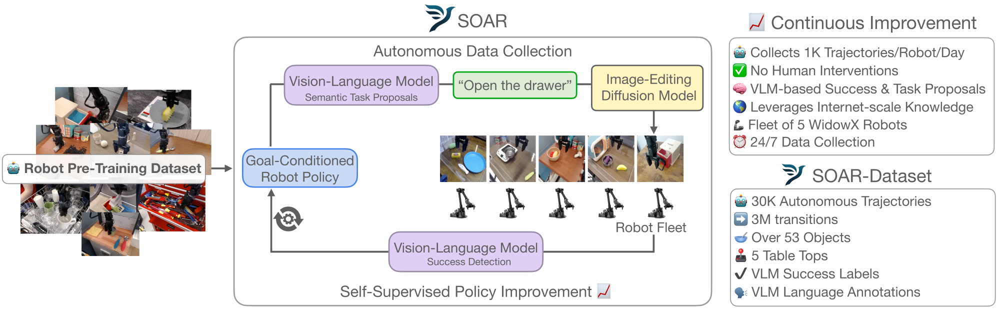
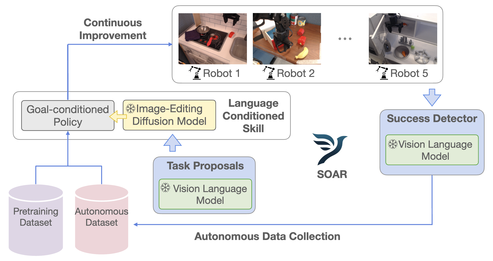

# SOAR: Autonomous Improvement of Instruction Following Skills via Foundation Models
[](media/soar_logo.jpeg)
[](https://arxiv.org/pdf/2407.20635)
[](https://githubtocolab.com/rail-berkeley/soar/blob/main/soar_data/load_soar_data.ipynb)
[](https://opensource.org/licenses/MIT)
[](https://auto-improvement.github.io/)

[Zhiyuan Zhou](https://zhouzypaul.github.io/), [Pranav Atreya](https://pranavatreya.github.io/), [Abraham Lee](https://www.linkedin.com/in/abraham-lee-4a0497242?original_referer=https%3A%2F%2Fwww.google.com%2F), [Homer Walke](https://homerwalke.com/), [Oier Mees](https://www.oiermees.com/), [Sergey Levine](https://people.eecs.berkeley.edu/~svlevine/)
<hr style="border: 2px solid gray;"></hr>

We present SOAR,  an approach to autonomously improve instruction following policies leveraging
foundation models. SOAR breaks down the autonomous improvement problem into components that import
Internet-scale knowledge from VLMs and a component that learns from autonomous data with a purely self-supervised objective.



This repository contains three components: (1) the VLM powered semantics-aware autonomous data collection pipeline, (2) converting the collected raw data into the RLDS format, and (3) Jax/Flax code for training the policies used in the paper.

## Using SOAR-Data

We have released SOAR-Data for public access [here](https://rail.eecs.berkeley.edu/datasets/soar_release/1.0.0/).
We also provided a download script to download the dataset in RLDS format, which requires 136G of disk space.
In this directory, run
```bash
bash soar_data/download_dataset.sh
```
This script should take around 20 minutes to download if you use the parallel download option, and we recommend downloading inside a tmux session.

To load the dataset for training and other downstream use cases, we have provided a minimal example [](https://githubtocolab.com/rail-berkeley/soar/blob/main/soar_data/load_soar_data.ipynb) that loads the dataset and visualizes it.

## Installation
```bash
conda create -n soar python=3.10
conda activate soar

# model training requirements
pip install -e model_training
pip install -r model_training/requirements.txt

# data collection requirements (you also need the jaxrl_m library above)
pip install -e data_collection
pip install -r data_collection/requirements.txt

# rlds conversion requirements
pip install -e rlds_converter
pip install -r rlds_converter/requirements.txt
```

If you would like to train models with Jax,
For GPU:
```bash
pip install --upgrade "jax[cuda11_pip]==0.4.20" -f https://storage.googleapis.com/jax-releases/jax_cuda_releases.html
```

For TPU:
```bash
pip install --upgrade "jax[tpu]==0.4.20" -f https://storage.googleapis.com/jax-releases/libtpu_releases.html
```


## Autonomous Data Collection

We provide a ready-to-use implementation of autonomous data collection on a fleet of WidowX robot arms. This data collection system is designed around deploying instruction following policies at scale to collect autonomous datasets that are semantically relevant, diverse, and large. Special care is taken to minimize human supervision during data collection, with features like automatic reset detection (and subsequent Slack notification).



Run autonomous data collection on the robot with:
```
python data_collection/orchestrator/robot/main.py --config_dir config/<robot_config_dir>
```

See [data_collection/README.md](data_collection/README.md) for more information on the setup required before running data collection.

## Model Training
This directory contains a self-contained python project for training goal-conditioned and language conditioned policies on Bridge and on Soar-Data.

To launch a training run, run:
```bash
cd model_training
bash experiments/scripts/launch.sh
```
This will launch [train.py](model_training/experiments/train.py) with the default arguments specified in [train_config.py](model_training/experiments/configs/train_config.py) and [data_config.py](model_training/experiments/configs/data_config.py).

## RLDS Data Conversion
We convert the raw data logged in the `data_collection/*` directories into the commonly used RLDS format. The conversion code is
located in the `rlds_converter` directory. See [rlds_converter/README.md](rlds_converter/README.md) for more information.

To build the SOAR dataset
```bash
cd rlds_converter/soar_dataset
CUDA_VISIBLE_DEVICES="" tfds build --manual_dir <path_to_raw_data>
```

## Citation
```
@article{zhou2024autonomous,
    title={Autonomous Improvement of Instruction Following Skills via Foundation Models},
    author={Zhiyuan Zhou and Pranav Atreya and Abraham Lee and Homer Walke and Oier Mees and Sergey Levine},
    journal = {arXiv preprint arXiv:407.20635},
    year={2024},
}
```

## Contributing
We welcome pull requests and bug reports to this repo.

To enable code checks and auto-formatting, please install pre-commit hooks (run this in the root directory):
```bash
pre-commit install
```
The hooks should now run before every commit. If files are modified during the checks, you'll need to re-stage them and commit again.
